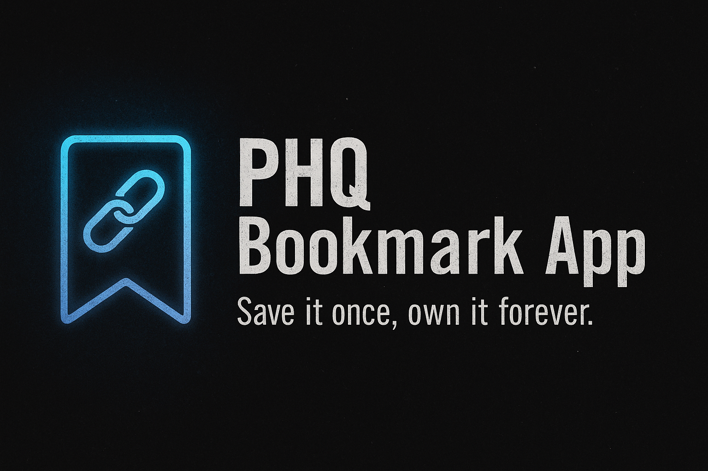

# PHQ Bookmark App

**Author:** Nick Gray
**Contact:** [nickjohngray@gmail.com](mailto:nickjohngray@gmail.com)

**Live** https://iridescent-travesseiro-1a9d22.netlify.app/



---

## Overview
A responsive, front-end-only bookmark manager built in **Angular** for the **PHQ Frontend Senior Developer Brief**.
Users can **add, edit, delete, and browse** bookmarks with custom URL validation, persistence via `localStorage`, and clean UX for desktop and mobile.

---

## Features

### Core (per brief)
- Add bookmark with **custom validation** and **existence check**.
- Inline **edit** and **delete** actions.
- **Pagination** — 20 per page with numbered and next/prev navigation.
- **Thank You page** confirming submission.
- **Persistent storage** (localStorage).
- Code follows **Google HTML/CSS & JavaScript Style Guides**.

### Extras
- **Mobile-friendly responsive design**.
- Smart protocol handling (auto-prepend, typo fix, unsafe scheme block).
- Duplicate URL detection with prompt.
- Keyboard navigation & focus management for accessibility.
- Link preview on hover (via screenshot API).

---

## Tech Stack
- **Framework:** Angular 16+
- **Language:** TypeScript
- **Storage:** Browser `localStorage`
- **Styling:** CSS (Google style guide compliant)

---

## Running the App

**Development**
```bash
npm install
ng serve
```

**Production**
```bash
npm run build:prod
npx serve -s dist/phq-bookmark-app/browser
```

---

## Live Demo & Repo
- **Live app:** [DEPLOYED_APP_URL_HERE]
- **Repository:** [REPO_URL_HERE]

---

## Documentation
See [`TECHNICAL_DESIGN_DOCUMENT.md`](./TECHNICAL_DESIGN_DOCUMENT.md) for:
- Architecture
- Feature breakdown
- Validation logic
- Accessibility decisions
- Known limitations
- Future enhancements

---

**Author:** Nick Gray
**Contact:** [nickjohngray@gmail.com](mailto:nickjohngray@gmail.com)
