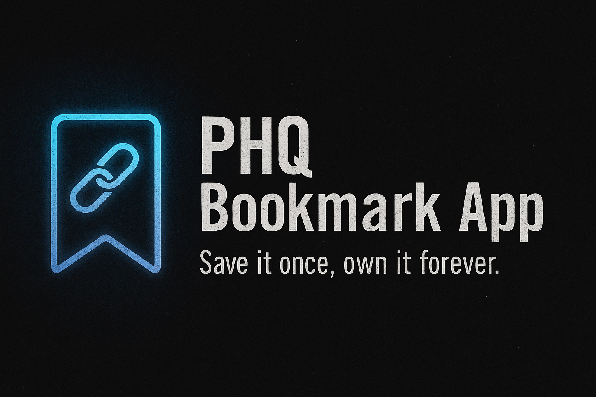

# **Technical Design Document – PHQ Bookmark App**

**Author:** Nick Gray
**Contact:** [nickjohngray@gmail.com](mailto:nickjohngray@gmail.com)

---

## **1. Overview**
The **PHQ Bookmark App** is a **front‑end only** Angular app to **add, edit, delete, and browse** bookmarks.
Data persists via **localStorage**. The app includes **custom URL validation**, **pagination**, and solid **accessibility/UX**.

---

## **2. Architecture**
- **Framework:** Angular (TypeScript)
- **Storage:** `localStorage`
- **Components/Services:**
  - **OverviewPage** — add form, list, pagination, edit/delete, hover/focus, navigation.
  - **ThankYouPage** — shows submitted URL + back link.
  - **BookmarkService** — single source of truth, storage I/O, duplicate detection, safe UUID.
  - **Bookmark model** — typed interface.
- **State:** Local component state for UI; persistent list managed by BookmarkService.

---

## **3. Core Features**
**Per brief:**
- Add with **custom validation** + best‑effort **existence check**.
- **Edit** inline with validation.
- **Delete** with immediate UI/storage sync.
- **Pagination**: 20 per page with numbered + next/prev controls.
- **Thank You page** showing the submission.
- **Persistence** across reloads.
- **Commented code** following **Google style guides**.

**Extra features added:**
- **Mobile‑friendly responsive design** (phones/tablets/desktops).
- Smart protocol handling: auto‑prepend (`https://` default; `http://` for localhost/IP).
- Protocol typo fixes (`htpp`, `ttps`, etc.) and unsafe scheme blocking.
- Duplicate detection with user prompt.
- Keyboard navigation (Arrow keys, Enter, Escape) and focus management.
- Clear separation of hover vs focus states.
- Link preview on hover (screenshot API).

---

## **4. Validation Logic**
- **`normalizeUserUrlInput(raw, defaultScheme)`**
  - Trim → correct scheme typos → normalize slashes → block unsafe schemes.
  - Returns normalized URL or `null`.
- **Existence check:** `fetch(url, { method: 'HEAD', mode: 'no-cors' })`
  If no response, prompt user to proceed or cancel.

---

## **5. Accessibility & UX Decisions**
- Keep **native blue focus outline** (visibility for keyboard users).
- Remove redundant tab stops.
- Keep **Edit/Open** buttons visible on hover (fast switching, consistent feedback).
- After dialogs/cancels, **restore focus** to the relevant control.

---

## **6. Performance Considerations**
- Smooth for typical use (a few hundred items).
- Rendering slows with **1000+** bookmarks due to DOM work.

---

## **7. Known Limitations**
- No backend; data is **device‑local** only.
- Link preview depends on a third‑party screenshot service.

---

## **8. Future Enhancements**
- **Optimize large datasets** (virtual scroll, lazy rendering, chunked updates).
- **Favicon** display for each bookmark.
- **Spinner** during URL existence checks.
- Search/filter, tagging, bulk import/export.
- Drag‑and‑drop reordering.
- Dark mode.
- Offline preview caching.

---

**Author:** Nick Gray — [nickjohngray@gmail.com](mailto:nickjohngray@gmail.com)
